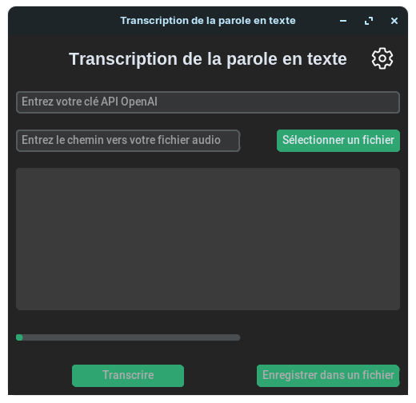
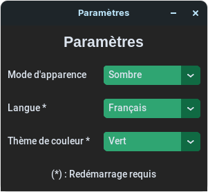

# SpeechToText

An english version of this README is available [here](README.md).

## Description

Ce programme est une interface graphique pour l'API Whisper d'OpenAI. Il vous permet de télécharger des fichiers audio et d'obtenir les fichiers texte correspondants. Cela peut être utile pour les journalistes qui veulent transcrire leurs interviews, ou pour toute personne qui veut transcrire ses fichiers audio. L'avantage de ce programme est qu'il peut être utilisé avec n'importe quel ordinateur ayant une connexion internet, sans avoir à installer de logiciel sur votre ordinateur. Dans cet esprit, ce programme est également utile pour les personnes qui n'ont pas d'ordinateur puissant pour exécuter un réseau neuronal, ou qui ne veulent pas installer de logiciel sur leur ordinateur. Il est également facile à utiliser et facilement traduisible.

## Utilisation

Le programme ne peut pas être exécuté à partir du code source car il utilise certaines fonctionnalités spécifiques à PyInstaller telles que `sys._MEIPASS`. Si vous voulez toujours exécuter le programme à partir du code source, vous devrez remplacer toutes les occurrences de `sys._MEIPASS` dans le code par `os.path.dirname(os.path.abspath(__file__))`.

Pour plus d'informations sur la construction du programme, consultez la section [Compilation](#compilation).

L'utilisation est la même pour Windows, Linux et MacOS. Vous pouvez télécharger le programme depuis la [page des versions](https://github.com/Chaxiraxi/SpeechToText/releases).

### Fenêtre principale

Voici une capture d'écran du programme :



Le programme est divisé en sections:

- L'entrée en haut est l'entrée de la clé API. Vous pouvez obtenir votre clé API depuis le [tableau de bord de votre compte OpenAI](https://platform.openai.com/account/api-keys). Au moment de la rédaction, les [prix](https://openai.com/pricing) sont de 0,006 $ par minute d'audio (arrondi à la seconde la plus proche).
- En dessous, vous avez l'entrée du chemin vers le fichier audio. Vous pouvez coller le chemin complet du fichier, ou vous pouvez cliquer sur le bouton pour ouvrir un explorateur de fichiers. Le programme ne prend pas en charge les dossiers, seulement les fichiers. Cela sera corrigé dans une version ultérieure.
- En dessous, vous avez la zone de texte de sortie. Elle affichera la sortie du programme. Si vous souhaitez enregistrer la sortie, vous pouvez cliquer sur le bouton pour ouvrir une boîte de dialogue d'enregistrement. Le programme enregistrera la sortie dans un fichier texte. Le nom du fichier sera le même que celui du fichier audio, mais avec l'extension `.txt`.
- En dessous, vous avez la barre de progression. Elle ne vous indiquera pas combien de temps il reste, mais elle vous indiquera le temps écoulé depuis le début du processus.
- En dessous, à côté du bouton d'enregistrement, vous avez le bouton de transcription. Vous pouvez cliquer dessus pour lancer le processus. Le bouton sera désactivé si la clé API est au mauvais format ou si le chemin est invalide.

### Fenêtre des paramètres

Voici une capture d'écran de la fenêtre des paramètres :



Ici, vous pouvez personnaliser l'apparence du programme. Vous pouvez modifier les paramètres suivants :

- Le thème, qui peut être soit `Clair`, `Sombre` ou `Système` qui suivra la configuration de votre système (Notez que `Système` ne fonctionnera que sur Windows et MacOS).
- La langue, qui peut être soit `Anglais` ou `Français`. Cela n'affectera pas la sortie du programme car Whisper détectera automatiquement la langue audio, mais cela affectera le texte affiché dans le programme. Consultez la section [Traduction](#traduction) pour plus d'informations.
- Le schéma de couleurs de l'application. Vous pouvez choisir entre les schémas de couleurs personnalisés par défaut de `customtkinter` qui sont `Bleu`, `Vert` et `Bleu foncé`

## Compilation

### Dépendances

Si vous voulez compiler le programme à partir des sources, vous devrez installer les dépendances suivantes : `customtkinter` et `openai`. Vous pouvez les installer avec les commandes suivantes :

```bash
pip3 install customtkinter openai
```

ou avec

```bash
pip3 install -r requirements.txt
```

Si vous voulez utiliser la version déjà compilée du programme, vous n'aurez pas besoin d'installer quoi que ce soit car les dépendances sont déjà incluses dans le programme.

Le programme est compatible avec Windows, Linux et MacOS.

### Compilation du projet

Même si le code Python est multiplateforme, le processus de compilation ne l'est pas. Vous devrez compiler le programme sur la plateforme que vous souhaitez utiliser, et le script de compilation n'est pas le même pour chaque plateforme.

Vous pouvez remarquer que les scripts de compilation sont différents et nommés respectivement `Compile-windows.spec`, `Compile-linux.spec` et `Compile-macos.spec`.

Attention, certains changements sont nécessaires dans le script de compilation avant de compiler le programme. Vous devez modifier les lignes faisant références à l'installation de `customtkinter` sur votre système. Vous pouvez trouver le chemin d'installation de `customtkinter` en exécutant la commande suivante dans un terminal :

```bash
pip3 show customtkinter
```

Voici ce que vous devez remplacer :

#### Windows

`c:\\users\\chaxiraxi\\appdata\\local\\packages\\pythonsoftwarefoundation.python.3.10_qbz5n2kfra8p0\\localcache\\local-packages\\python310\\site-packages\\customtkinter`

#### Linux

`/home/davidg/.local/lib/python3.8/site-packages/customtkinter`

#### MacOS

`/Library/Frameworks/Python.framework/Versions/3.11/lib/python3.11/site-packages/customtkinter`

Vous pouvez ensuite compiler le programme avec les commandes suivantes en fonction de la plateforme que vous souhaitez utiliser :

```bash
pyinstaller [nom-du-fichier-specifique-a-la-plateforme].spec
```

Une fois le programme compilé, vous pouvez trouver l'exécutable dans le dossier `dist`. Sur MacOS, vous obtiendrez un bundle d'application, que vous pouvez utiliser comme une application MacOS normale. Pour Windows et Linux, vous obtiendrez un dossier contenant les bibliothèques et les dépendances compilées, ainsi qu'un fichier exécutable nommé `GUI` sur Linux ou `GUI.exe` sur Windows. Vous pouvez déplacer le dossier où vous le souhaitez et exécuter le fichier exécutable.

## Traduction

Les traductions sont stockées au format JSON dans le dossier `language`. Les noms de fichier sont les codes de langue et le contenu est un objet JSON. N'hésitez pas à contribuer à la traduction du programme en créant une pull request. Note : j'ai découvert que ChatGPT était en fait très bon pour traduire les valeurs des clés JSON.

Vous devrez ensuite modifier la fenêtre de paramètres dans `GUI.py` pour ajouter la nouvelle langue à la combobox de langue. N'oubliez pas de traduire le nom de la nouvelle langue elle-même dans les autres langues déjà existantes.
