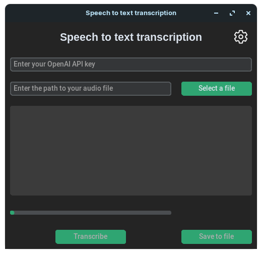
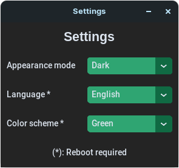

# SpeechToText

Un version française de ce fichier est disponible [ici](README-FR.md).

## Description

This program is a GUI for the OpenAI Whisper API. It allows you to upload audio files and get the corresponding text files. This can be useful for journalists who want to transcribe their interviews, or for anyone who wants to transcribe their audio files. The advantage of this program is that it can be used with any computer having an internet connexion, without having to install any software on your computer. With that in mind, this program is also useful for people who don't have a powerful computer to run a neural network, or who don't want to install any software on their computer. It is also open source, easy to use and easily translatable.

## Usage

The program cannot be run from source since it is using some PyInstaller specific features like `sys._MEIPASS`. If you still want to run the program from source, you will need to replace all the `sys._MEIPASS` occurences in the code by `os.path.dirname(os.path.abspath(__file__))`.

For more information about building the program, see the [Building](#building) section.

The usage is the same for Windows, Linux and MacOS. You can download the program from the [releases page](https://github.com/Chaxiraxi/SpeechToText/releases).

### Main window

Here is a screenshot of the program:



The program is divided into sections:

- The top entry is the API Key entry. You can get your API Key from the [Your OpenAI Account dashboard](https://platform.openai.com/account/api-keys). At the time of writing, the [pricing](https://openai.com/pricing) is $0.006 per minute of audio (rounded to the nearest second).
- Below, you have the path entry. You can paste the full audio path, or you can click on the button to open a file explorer. The program doesn't support folders, only files. This will be fixed in a future version.
- Below, you have the output text box. It will display the output of the program. If you want to save the output, you can click on the button to open a save dialog. The program will save the output in a text file. The name of the file will be the same as the name of the audio file, but with the `.txt` extension.
- Below, you have the progress bar. It won't tell you how much time is left, but it will tell you how much time has passed since the start of the process.
- Below, next to the save button, you have the transcribe button. You can click on it to start the process. The button will be disabled if the API Key is in an invalid format, or if the path is invalid.

### Settings window

Here is a screenshot of the settings window:



Here you can customize the appearance of the program. You can change the following settings:

- The theme, which can be either `Light`, `Dark` or `System` which will follow your system's configuration (Note that `System` will only work on Windows and MacOS).
- The language, which can be either `English` or `French`. This won't affect the output of the program since Whisper will automatically detect the audio language, but it will affect the text displayed in the program. See the [Translating](#translating) section for more information.
- The color scheme of the application. You can choose between the default customtkinter color schemes which are `Blue`, `Green` and `Dark blue`

## Building

### Dependencies

If you want to compile the program from source, you will need to install the following dependencies: `customtkinter` and `openai`. You can install them with the following commands:

```bash
pip3 install customtkinter openai
```

or with

```bash
pip3 install -r requirements.txt
```

If you want to use the already compiled version of the program, you won't need to install anything since the dependencies are already included in the program.

The program is compatible with Windows, Linux and MacOS.

### Compiling

Even if the python code is cross-platform, the compiling process is not. You will need to compile the program on the platform you want to use it on, and the compile script is not the same for each platform.

You can notice that they are different compile scripts respectively named `Compile-windows.spec`, `Compile-linux.spec` and `Compile-macos.spec`.

Warning, some changes are neccessary to the compile scripts before building the project. You need  to replace the references to the `customtkinter` installation path with the path to your `customtkinter` installation. You can find the path to your `customtkinter` installation by running the following command:

```bash
pip3 show customtkinter
```

Here's what you need to replace :

#### Windows

`c:\\users\\chaxiraxi\\appdata\\local\\packages\\pythonsoftwarefoundation.python.3.10_qbz5n2kfra8p0\\localcache\\local-packages\\python310\\site-packages\\customtkinter`

#### Linux

`/home/davidg/.local/lib/python3.8/site-packages/customtkinter`

#### MacOS

`/Library/Frameworks/Python.framework/Versions/3.11/lib/python3.11/site-packages/customtkinter`

You can then compile the program with the following commands depending on the platform you want to use it on:

```bash
pyinstaller [platform-spec-file].spec
```

Once the program is compiled, you can find the executable in the `dist` folder. On MacOS, you will get an app bundle, which you can use as a normal MacOS app. For Windows and Linux, you will get a folder containing the compiled libraries and dependencies, and an executable file named `GUI` on Linux or `GUI.exe` on Windows. You can move the folder wherever you want, and run the executable file.

## Translating

Translation are stored in JSON format in the `language` folder. The file names are the language codes, and the content is a JSON object. Feel free to contribute to the translation of the program by creating a pull request. Note: I found out that ChatGPT was actually very good for translating JSON key values.

You will then need to edit the settings window in `GUI.py` to add the new language to the language combobox. Don't forget to translate the new language name itself in other already existing languages.
